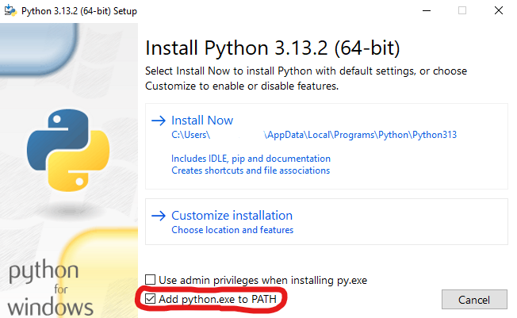
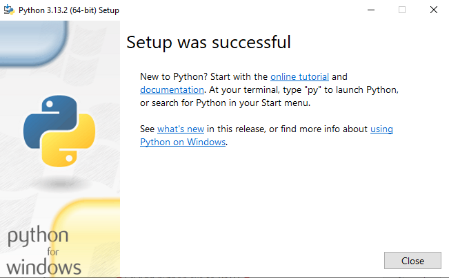
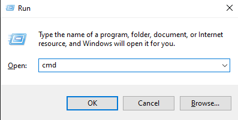
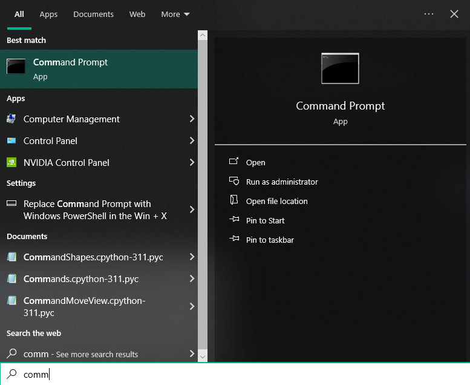
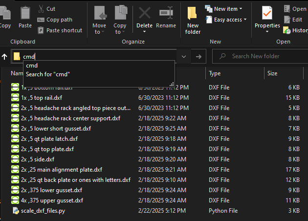

What it does: 

Installation:

Python: https://www.python.org/downloads/ 

Download and run python_xxx_.exe

MAKE SURE TO CHECK "Add python.ext to PATH.
Click install now.

Should see Setup was Sucessful. Close window.

Open Command Prompt win+r cmd or windows key, type cmd and click on command prompt.

Type or copy and right click in command prompt to paste, then hit enter to run. 

'python --version'

This checks to make sure python was installed correctly. should return "Python x.xx.x

Update pip with:

'python.exe -m pip install --upgrade pip'

Then install easydxf by pasting the following in command prompt.

'pip install ezdxf'

Thus ends the installation. To use the script paste the "scale_metric_dxf_files_to_imperial.py" file into a folder. When you double click on the "scale_metric_dxf_files_to_imperial.py" file it will create duplicate scaled files of all dxf's in that folder and add "imperial_" to the beginning of the filename.

Alternatively once you paste the file into a folder, you can run it by clicking on the address bar, typing cmd and pressing enter. This will bring a command prompt window up in the folder you were in. You can then run the file by typing 'scale_metric_dxf_files_to_imperial.py' and pressing enter. If you start typing you can press tab and it will autofill the rest of the name. 

Enjoy!

